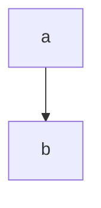

# Mammoth MCII 18203 Center stage

## Basic operation
### Teleop main is the only teleop used in competition grips servos on initialization

### Vision Front:
this uses the white tape on the robot to line up with the inner edge of the left side of the tile on the side away from the backdrop. 
it follows the basic line 
- check three locations for team prop
- the spot with either the most red or most blue is selected as the location for the team prop
- travels to the line and drops pixel
- then depending on the identified side, parks at the backdrop
#### Full Diagram:

### Vision Back:
this uses the white tape on the robot to line up with the inner edge of the left side of the tile on the side near the backdrop. 
it follows the basic line 
- check three locations for team prop
- the spot with either the most red or most blue is selected as the location for the team prop
- travels to the line and drops pixel
- then depending on the identified side, parks at the backdrop
