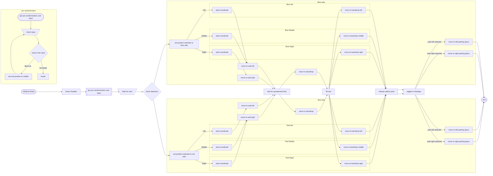

# Mammoth MCII 18203 Center stage

## Basic operation
### Teleop main:
this is the only teleop used in competition
the controls are:
- Left Analog y-axis: robot rotation
- Right Analog: robot movement, uses strafe with mecanum wheels
- DPad Up: winch up
- DPad Down: winch down
- DPad Left: release winch*
- DPad Right: launch plane*
- L1(Left Bumper): Top Gripper*
- R1(Right Bumper): Bottom Gripper*
- L2(Left Trigger): Analog speed reduction
- Triangle: Flip hand*
- Square: "jiggle"
- Cross: Arm down
- Circle: Arm up

"*" indicates toggle

The "jiggle" is where the robot does a little shaking to dislodge any pixels that may be stuck in the gripper when placed on the backdrop. While release winch and launch plane are both on toggles, this is merely for resetting purposes as both of these can only be activated once per game without being manually reset by hand.

### Vision Front:
this uses the white tape on the robot to line up with the inner edge of the left side of the tile on the side away from the backdrop. 
it follows the basic line 
- check three locations for team prop
- the spot with either the most red or most blue is selected as the location for the team prop
- travels to the line and drops pixel
- then depending on the identified side, parks at the backdrop
#### Full Diagram:

### Vision Back:
this uses the white tape on the robot to line up with the inner edge of the left side of the tile on the side near the backdrop. 
it follows the basic line 
- check three locations for team prop
- the spot with either the most red or most blue is selected as the location for the team prop
- travels to the line and drops pixel
- then depending on the identified side, parks at the backdrop
#### Full Diagram:

In autonomous we discovered that there is one spot where the pixel can reliably be placed from a height and not bounce out of its intended position

